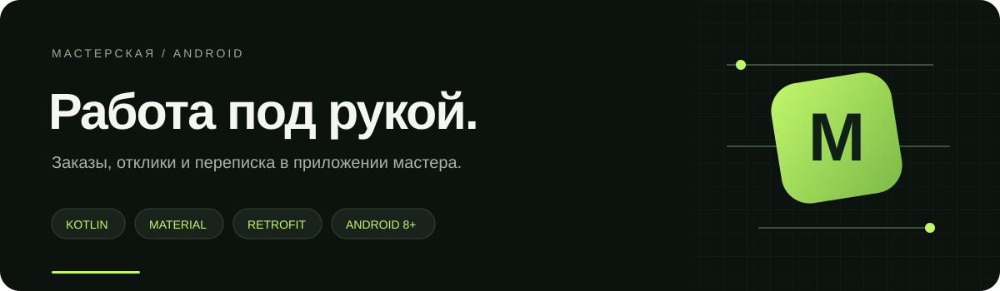
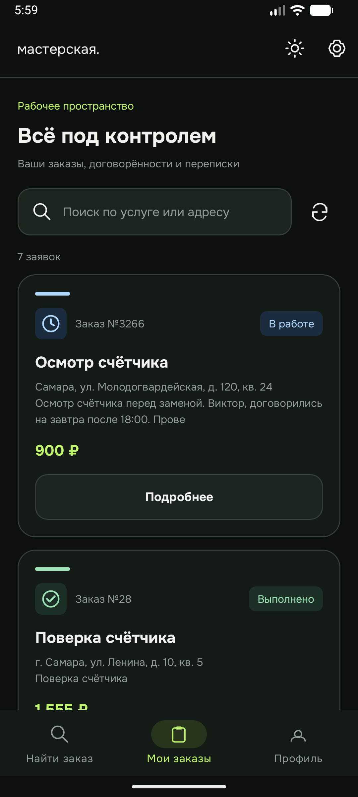
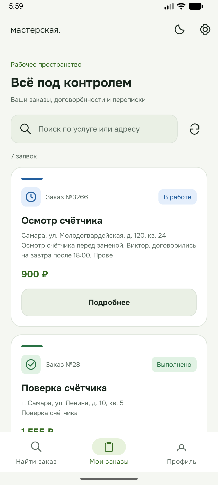

<div align="center">



**Находите заказы. Договаривайтесь. Выполняйте работу.**<br />
Android-клиент дипломного маркетплейса «Мастерская» для роли `MASTER`.


[Скриншоты](#интерфейс) · [Запуск](#запуск) · [API и сайт](https://github.com/ComoffmansCorp/consumer-maintenance-system)

</div>

## Рабочий день мастера — в одном приложении

| Найти заказ | Выполнить работу | Развивать профиль |
| :--- | :--- | :--- |
| Заявки по специализациям | Назначенные заказы и история | Город и описание опыта |
| Поиск по услуге и адресу | Карточка заказа со статусом и ценой | Выбор специализаций |
| Отклик с ценой и комментарием | Чат с заказчиком и завершение | Фото, рейтинг и отзывы |

После отклика **заказчик выбирает исполнителя**. Приложение не назначает мастера на заявку автоматически. После назначения заказ появляется в «Моих заказах» и становится доступна переписка.

## Интерфейс

<p align="center">
  
  &nbsp;&nbsp;
  
</p>

Общая с сайтом палитра, светлая и тёмная темы, нижняя навигация, Onest и Unbounded. Статусы обозначены цветом и значком: часы, галочка, крестик. Фотографии загружаются через общий API Gateway.

## Запуск

### 1. Поднимите API

Backend находится в отдельном репозитории:

```bash
git clone https://github.com/ComoffmansCorp/consumer-maintenance-system.git
cd consumer-maintenance-system
cp .env.example .env
# Заполните JWT_SECRET в .env, затем:
docker compose up -d --build
```

Полная инструкция и описание демо — в [основном README](https://github.com/ComoffmansCorp/consumer-maintenance-system#быстрый-запуск).

### 2. Откройте Android-проект

```bash
git clone https://github.com/ComoffmansCorp/android-customer.git
```

Откройте каталог в Android Studio, дождитесь синхронизации Gradle и установите запрошенные SDK-компоненты. Проект использует **compile SDK 36.1**, **target SDK 36**, **min SDK 26**, **AGP 9.2.1** и **Gradle 9.4.1**. Для Gradle используйте совместимый JDK из Android Studio.

Запустите приложение на эмуляторе Android 8.0 или новее.

### 3. Подключитесь и войдите

| Окружение | Адрес API |
| :--- | :--- |
| Android Emulator | `http://10.0.2.2:8000/` — используется по умолчанию |
| Телефон в той же сети | `http://<LAN-IP-компьютера>:8000/` |

Адрес меняется в **настройках приложения**, пересборка не нужна. `localhost` на телефоне или эмуляторе указывает на само устройство.

**Демо-вход: `master1` / `demo12345`.** На экране входа есть кнопка демо-мастера. Роль заказчика работает на сайте; мастер также может войти в веб-кабинет с этими же данными.

Для проверки связи откройте сайт под `client1` / `demo12345`: у этой пары уже есть назначенный заказ с чатом и открытая заявка с предложением мастера. ID зависят от состояния базы.

## Сборка и тесты

Из корня Android-проекта:

```bash
./gradlew :app:assembleDebug :app:testDebugUnitTest
```

APK: `app/build/outputs/apk/debug/app-debug.apk`.

Тест `ProfileAvatarSerializationTest` проверяет, что запрос сохранения профиля передаёт существующую ссылку на фотографию.

## Технологии

| Задача | Реализация |
| :--- | :--- |
| Экраны | Kotlin, XML, Fragments, ViewBinding, Material Components |
| Навигация | AndroidX Navigation, нижнее меню |
| Сеть | Retrofit, OkHttp, Gson, JWT access/refresh |
| Асинхронность | Coroutines, lifecycleScope |
| Фотографии | Coil |
| Переписка | REST, обновление каждые 5 секунд на открытом экране |
| Настройки | SharedPreferences: сервер и тема |

```text
app/src/main/java/com/example/myapplication/
├── AvailableRequestsFragment.kt    поиск заявок и отклик
├── MyRequestsFragment.kt           назначенные заказы
├── RequestDetailFragment.kt        карточка, чат, завершение
├── MasterProfileFragment.kt        профиль и специализации
├── SettingsFragment.kt             адрес API и тема
├── AuthManager.kt                 состояние авторизации
└── network/                       Retrofit API и DTO
```

## Общая платформа

Приложение и сайт используют одни аккаунты, заявки, предложения, отзывы и сообщения. Правила доступа и переходы статусов проверяет Go API. Эскроу-платежи в проекте — симуляция; настоящих списаний нет.

[Сайт и backend →](https://github.com/ComoffmansCorp/consumer-maintenance-system)

Лицензии шрифтов находятся в [`app/src/main/assets/fonts`](app/src/main/assets/fonts).

---

<p align="center"><sub>Мастерская · Android · <a href="https://github.com/ComoffmansCorp">ComoffmansCorp</a></sub></p>
